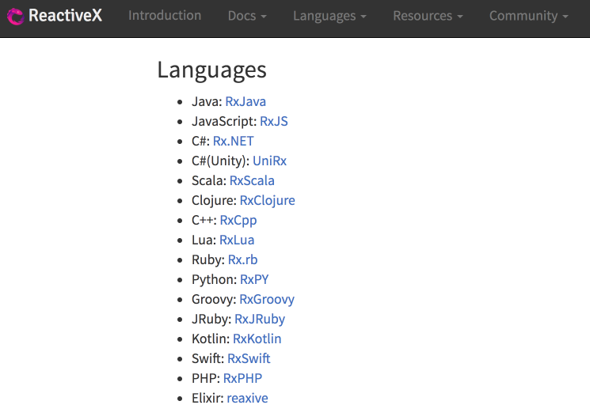

# Reactive Programming Introduction

---

## Job of a programmer

* I write some code.                  <!-- .element: class="fragment" -->
* Then I'll find some bugs.           <!-- .element: class="fragment" -->
* Something went wrong with my code.  <!-- .element: class="fragment" -->
* I'll fix the bugs.                  <!-- .element: class="fragment" -->
* How do I fix the bugs?              <!-- .element: class="fragment" -->
* By writing more code.               <!-- .element: class="fragment" -->
* Repeat ...                          <!-- .element: class="fragment" -->

Note: Solving one problem often introduces other problems. By changing the way of thinking, we can ofen find a simple solution to seemingly hard problem.

---

### How a single Node.js server can handle 10,000 requests/sec?

* Asynchronous event-driven  
* Non-blocking I/O           
* Just-in-time processing    
* High-throughput concurrency

Note: JavaScript is ubiquitous. Web apps running in browser, mobile app development, server apps.

---

## Sync or Async

```
user do an action
       │
       v
 application start processing action
   └──> make database request
          └──> do nothing until request completes
 request complete
   └──> send result to user

```
----

```
request ──> make database request
request ──> make database request
request ──> make database request
database request complete ──> send response
database request complete ──> send response
database request complete ──> send response
```
Note: Think about Disneyland Fast Track System as an example.

---

## Async programming seems hard

* Race conditions         
* Memory leaks            
* Complex state management
* Uncaught async errors   

Note: Think about missle launcher as an example.

---

## Reactive Extensions (Rx)


> "ReactiveX is a combination of the best ideas from the Observer pattern, the Iterator pattern, and functional programming."

Note: Changing the way of thinking helps to tackle the hard issues related to async programming.

---

## Rx benefits


---

## Polyglot Rx


---

## Be functional

* First class function (pure function)
* High-order function
* Immutability
* Higher level of abstraction

Note: Functional programming are more expressive and enable programmers to write less code. Pure functions works as read-only hash tables.

---

## ES6 fat-arrow function notation

```JavaScript
function(x, y) {
  return x + y;
}
```
----

```JavaScript
// implicit return
(x, y) => x + y  

// explicit return
(x, y) => {
  return x + y;
}
```

---

## Example 1

The reduce() function

```JavaScript
sum (inputList) {
  result = 0;
  for (let i of inputList) {
    result += i;
  }
  return result;
}
```
----

```JavaScript
sum = inputList.reduce((s, i) => s+i)
```

Note: reduce() is a high-order function and it is a pure function

---

## Example 2

The map() function

```JavaScript
sumSquared (inputList) {
  result = 0;
  for (let i of inputList) {
    result += i*i;
  }
  return result;
}
```
----

```JavaScript
sum = inputList
      .map(i => i*i)
      .reduce((s, i) => s+i)
```

---

## Example 3

The filter() function

```JavaScript
sumEvenSquared (inputList) {
  result = 0;
  for (let i of inputList) {
    if (i%2 == 0)
      result += i*i;
  }
  return result;
}
```
----

```JavaScript
sum = inputList
      .filter(i => i%2 == 0)
      .map(i => i*i)
      .reduce((s, i) => s+i)
```

Note: pure functions are composable; operations can be done on collections without loops;

---

## Two design patterns

* Iterator Pattern
* Observer Pattern

---

## The Iterator Pattern


---

## Iterator in action

```Java
// create an Iterator from List
Iterator<String> nameIterator = nameList.iterator();

while(nameIterator.hasNext()) {
  System.out.println(nameIterator.next());
}
```

---

## The Observer Pattern


---

## Observer in action

```JavaScript
button1.onclick(function(event) {

  console.log(event.target);

  // actions taken on event

});
```

---

## Observable

> The only Rx data structure you need

* Observable emits values in order (like an iterator)
* Observable "pushes" values to subscriber (observer)
* Observables can be copied, transformed and queried (like SQL)
* Observables are "lazy"
* Everything is observable

---

## A problem to consider

Capture the first 10 clicks on the right half of the browser window.

---

## Solutions

```
var​ clicks = 0;​ 
document.addEventListener(​'click'​, 
  function​ registerClicks(e) {​  
    ​if​ (clicks < 10) {​
      if​ (e.clientX > window.innerWidth/2) {​
        console.log(e.clientX, e.clientY);​       
        clicks += 1;​     
      }​   
    } ​else​ {​
      document.removeEventListener(​'click'​, registerClicks);​
    }​ 
});
```
----

```JavaScript
Rx.Observable
  .fromEvent(document, ​'click'​)
​  .filter(​c => c.clientX > window.innerWidth/2)
​  .take(10)
​  .subscribe(​c => console.log(c.clientX, c.clientY))
```

Note: comparing traditional way vs Rx way

---

## Thinking reactively

> "Your mouse is a database."

```JavaScript
Rx.Observable
  .fromEvent(document, ​'click'​)
​  .filter(​c => c.clientX > window.innerWidth/2)
​  .take(10)
​  .subscribe(​c => console.log(c.clientX, c.clientY))
```
----

```SQL
SELECT​ x, y ​FROM​ clicks ​
WHERE x > window_width/2
LIMIT​ 10
```

---

## Create observables

```
const source$ = new Rx.Observable(observer => {

  // send some data
  observer.next("hello world");
  observer.next([1,2,3,4,5]);
  observer.next({id: 12, name: "Bruce Wayne"});

  // throw an error
  observer.error(new Error("Error: panic!"));

  // completed
  observer.complete();

});
```

---

<!-- .slide: data-transition="fade-in fade-out" -->
## Subscribe to observables

```
const source$ = new Rx.Observable(observer) => {
  // implemention omitted
});

source$
  //optional error catcher
  .catch(err => Rx.Observable.of(err))
  .subscribe(
    data => { console.log(data); },
    // optional error handler
    error => { console.log(error); },
    // optional completion handler
    () => { console.log("completed"); }
  );
```

---

<!-- .slide: data-transition="fade-in fade-out" -->
## Subscribe to observables

A simplified way

```
const source$ = new Rx.Observable(observer) => {
  // implemention omitted
});

source$.subscribe(data => { 
  console.log(data);
});

```

---

## Create observables from other data structures

```
// From a collection or iterator
const value$ = Rx.Observable.from([1,2,4,5,6,7,8,9]);

// From a DOM event
const input$ = Rx.Observable.fromEvent(textInput, 'keyup');

// From an XHR
const request$ = Rx.Observable.ajax(url);

// From a Promise
const promise = new Promise((resolve, reject) => {
  resolve(42);
});
const source$ = Rx.Observable.fromPromise(promise);
```

---

## Operations on observables

* Transforming: map, buffer, switchMap
* Combining: merge, concat, zip, join
* Filtering: debounce, filter, skip, take, distinct
* Creating: timer, interval, range
* Conditional: all, skipUntil, takeUntil
* Math: count, max, min, sum, reduce

[Rx Operators Documentation](http://reactivex.io/documentation/operators.html)

---

## Map


---

## Filter


---

## Merge


---

## Concat


---

## Debounce


---

## Buffer


---

## Zip


---

## switchMap (flatMap)


---

## Exercise

> How to do drag-and-drop in Rx way?

---

## Resources

* RxJS official source code repository on GitHub
* ReactiveX, a collection of resources related to the Reactive Extensions
* RxMarbles, an interactive tool to visualize Observables[7]

---

> <small>To a curious observer, everything is observable.</small>

